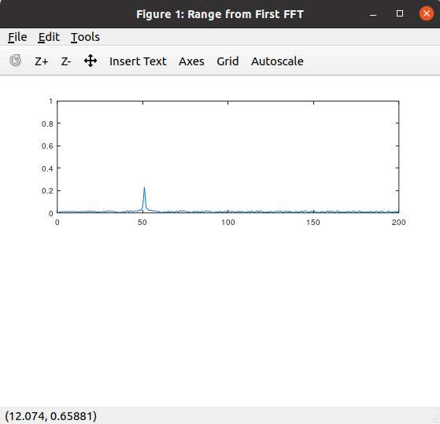
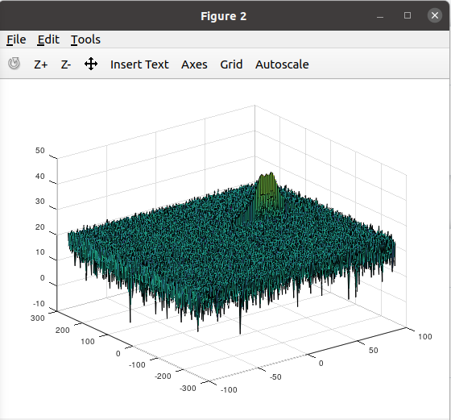

# SFND_Radar_Target_Detection

Target initial poistion = 50  
Target initial Velocity = 50  

  

  

### 2D CFAR

Select the number of Training Cells in both the dimensions:  
Tr = 10  
Td = 8  

Select the number of Guard Cells in both dimensions around the Cell under test (CUT) for accurate estimation:  
Gr = 4  
Gd = 4  

Implementataion steps for 2D CFAR :
1. Determine the number of Training cells for each dimension Tr and Td. Similarly, pick the number of guard cells Gr and Gd.
2. Slide the Cell Under Test (CUT) across the complete cell matrix
3. Select the grid that includes the training, guard and test cells. Grid Size = (2Tr+2Gr+1)(2Td+2Gd+1).
4. The total number of cells in the guard region and cell under test. (2Gr+1)(2Gd+1).
5. This gives the Training Cells : (2Tr+2Gr+1)(2Td+2Gd+1) - (2Gr+1)(2Gd+1)
6. Measure and average the noise across all the training cells. This gives the threshold
7. Add the offset (if in signal strength in dB) to the threshold to keep the false alarm to the minimum.
8. Determine the signal level at the Cell Under Test.
9. If the CUT signal level is greater than the Threshold, assign a value of 1, else equate it to zero.
10. Since the cell under test are not located at the edges, due to the training cells occupying the edges, we suppress the edges to zero. Any cell value that is neither 1 nor a 0, assign it a zero.

The process above will generate a thresholded block, which is smaller than the Range Doppler Map as the CUT cannot be located at the edges of matrix. Hence,few cells will not be thresholded. To keep the map size same set those values to 0. 
 
`[lr, lc] = size(RDM);
RDM(union(1:(Tr + Gr), lr - (Tr + Gr - 1) : lr), :) = 0;`  
`RDM( : , union(1 : (Td + Gd), lc - (Td + Gd - 1) : lc)) = 0;`